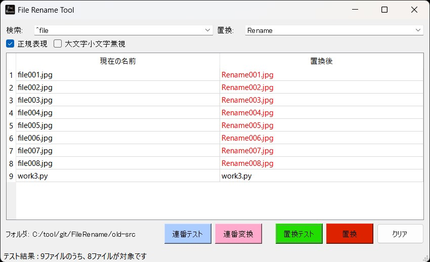

## FileRenameについて 0.1.0
Fileのリネームを正規表現を用いて行うツールです  
事前に変更後のファイル名がどうなるかを確認してから一括置換を行えます  
またファイル名を連番にする機能もあります  

！！！ファイル名を変換するというツールの性質上、十分に注意して利用してください！！！  

## インストール方法（簡易）
[簡易インストール版zipのダウンロード] https://github.com/nekotodance/FileRename/releases/download/latest/FileRename.zip

- zipファイルを解凍
- 解凍したフォルダ内の「FileRename-install.ps1」を右クリックして「PowerShellで実行」を選択
- イントールの最後にデスクトップにリンクをコピーするかどうかを聞いてきます  
「"Do you want to copy the shortcut to your desktop? (y or enter/n)」  
必要があれば「y」入力後、もしくはそのまま「enter」キー  
必要なければ「n」入力後「enter」キー  
- FileRenameリンクが作成されます

リンクファイルをダブルクリックして起動できます

## インストール方法（手動）
#### 必要なライブラリ
    PyQt5 natsort
#### 動作確認
    py FileRename.py

## 利用方法
#### 1) アプリ上に複数のファイルかフォルダをドラッグ＆ドロップしてください  
複数のファイルかフォルダのドロップに対応しています※1  
単一のフォルダをドロップした場合のみ、直下のファイルとフォルダをリストに追加します  

※1 : ただしファイルならファイル、フォルダならフォルダのみ受け付けます

#### 2) 置換操作  
###### 2-1) 検索と置換文字列の設定
検索する文字列と、置換する文字列を指定してください  
検索文字列には以下のオプションがチェックボックスにて指定できます  
- 正規表現 : チェックすると正規表現による検索を行えます
- 大文字小文字無視 : チェックすると大文字小文字を無視して検索を行えます

###### 2-2) 置換テストと置換処理
置換テストボタンでは、置換後にどのようなファイル名になるかが表の右側に表示されます  
置換が行われるファイル名は赤字で表示されます  

置換処理では置換テストが裏で行われ、本当に置換処理を実施してよいかの確認ダイアログが表示されます  
問題なければ「Yes」を、中止するなら「No」を選択してください  

###### 3) 連番操作  
###### 3-1) 連番テストと連番変換処理
連番機能では検索や置換、正規表現などのチェックボックスも参照しません  
連番テストボタンでは登録されたファイル名を連番にした場合のファイル名が表の右側に表示されます※2  

また連番をつける対象とするファイルはbase部分と拡張子部分が揃っているファイルのみを対象とします※3  
ただし複数のフォルダのみがドロップされている場合に限り、例外的にフォルダ名も連番対象とします  

連番変換は置換処理と同じ流れとなります  

※2 : 連番は最低3桁の0パディングとなり、もし対象ファイルが1000ファイルを超える場合は4桁のように拡大されます  
※3 : 例えば.gitignoreの様に拡張子部分だけのファイルなどは対象外としています  

###### 4) クリア
検索と置換の入力済み文字列やリストをすべてクリアします  

###### 5) 検索と置換コンボボックスの履歴について
検索と置換のコンボボックスでは過去20件の履歴が保存されます  
もし不要となった場合には、右クリックメニューから「Historyのクリア」を選択すると、過去の履歴が削除されます  

#### status
以下のような動作状況が表示されます  
- ドラッグ＆ドロップしたファイルやフォルダの状況  
- テストや置換処理を行った結果表示  
- エラー発生時の状況  

## 注意事項
- ファイル名を変換するというツールの性質上、十分に注意して利用してください  
- 基本的にファイルならファイルだけ、フォルダならフォルダだけでの利用をお勧めします  
- リストへの登録時にnatsortを利用してファイル名のソートを行っていますが、Windowsのソート順と同じかは保証しません  
- Windowsの場合はtest.txtとTest.txtが同じファイル名として扱われます。そのため一部を大文字にするような置換は出来ません  

## 変更履歴
- 0.1.0 初版  

以上
